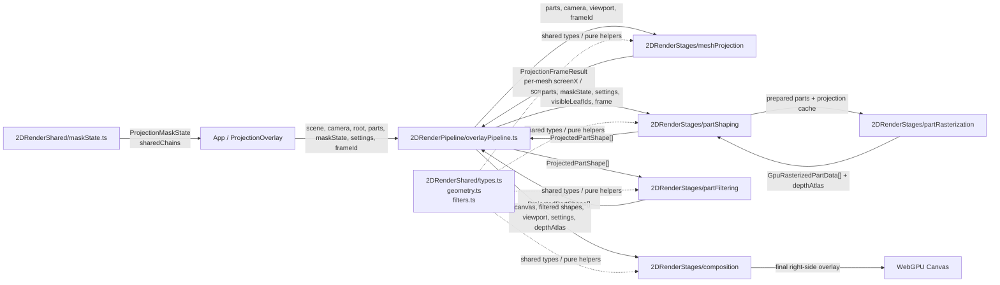

# 2DRender Pipeline

```mermaid
flowchart LR
    A["App / ProjectionOverlay"] -->|"scene, camera, root, parts, maskState, settings, frameId"| B["2DRenderPipeline/overlayPipeline.ts"]

    B -->|"parts, camera, viewport, frameId"| C["2DRenderStages/meshProjection"]
    C -->|"ProjectionFrameResult
per-mesh screenX / screenY / depth"| B

    B -->|"parts, maskState, settings, visibleLeafIds, frame"| D["2DRenderStages/partShaping"]
    D -->|"prepared parts + projection cache"| E["2DRenderStages/partRasterization"]
    E -->|"GpuRasterizedPartData[] + depthAtlas"| D
    D -->|"ProjectedPartShape[]"| B

    B -->|"ProjectedPartShape[]"| F["2DRenderStages/partFiltering"]
    F -->|"filtered ProjectedPartShape[]"| B

    B -->|"canvas, filtered shapes, viewport, settings, depthAtlas"| G["2DRenderStages/composition"]
    G -->|"final right-side overlay"| H["WebGPU Canvas"]

    I["2DRenderShared/maskState.ts"] -->|"ProjectionMaskState
sharedChains"| A
    J["2DRenderShared/types.ts
geometry.ts
filters.ts"] -.->|"shared types / pure helpers"| C
    J -.->|"shared types / pure helpers"| D
    J -.->|"shared types / pure helpers"| F
    J -.->|"shared types / pure helpers"| G
```
