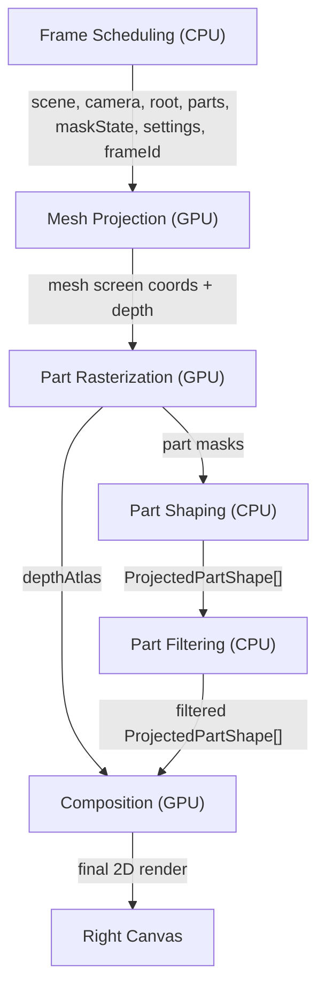

# 2DRender Pipeline



| Processing | Main files |
| --- | --- |
| `Frame Scheduling (CPU)` | [ProjectionOverlay.tsx](src/components/ProjectionOverlay.tsx), [overlayPipeline.ts](src/lib/2DRenderPipeline/overlayPipeline.ts) |
| `Mesh Projection (GPU)` | [2DRenderStages/meshProjection/](src/lib/2DRenderStages/meshProjection/) |
| `Part Rasterization (GPU)` | [2DRenderStages/partRasterization/](src/lib/2DRenderStages/partRasterization/) |
| `Part Build (CPU)` | [2DRenderStages/partShaping/](src/lib/2DRenderStages/partShaping/) |
| `Part Filtering (CPU)` | [2DRenderStages/partFiltering/](src/lib/2DRenderStages/partFiltering/) |
| `Composition (GPU)` | [2DRenderStages/composition/](src/lib/2DRenderStages/composition/) |
| `Shared Data And Helpers` | [2DRenderShared/](src/lib/2DRenderShared/) |

## Flat-Paint Style

The overlay now derives three paint layers from the skinned face normals and a fixed world-space light:

- `shadow`: darker, warm-toned region
- `base`: sampled texture/material color
- `highlight`: lighter region

Each layer is rasterized independently, depth-filtered against the other projected layers, simplified into a 2D contour, and composed with the configurable warm outline and background color.

The PMX/VMD assets are intentionally external. The downloaded `models` directory is mirrored into `public/models` for Vite's static serving:

```text
models/可琳_by_绝区零_2bdf4e664d2349e13c899f884728ce53/可琳.pmx
models/vmd/Aerial.vmd
```

The 2D view requires WebGPU. Unsupported browsers keep the Three.js viewport visible and show a capability message in the result pane.

## Video Export

The left control panel starts with an expandable `Export Video` section. It can export the current animation frame-by-frame as:

- the 2D result;
- the 3D viewport; or
- a side-by-side 3D + 2D video.

The export range, frame step, FPS, and output scale are configurable. When WebCodecs is available, each sampled frame is encoded with an explicit timestamp, so the output duration is exactly `sampled frame count / FPS`; expensive projection work does not stretch playback time. Export temporarily pauses playback, waits for the projection pipeline to finish each selected frame, and restores the previous animation time and playback state when it completes or is cancelled.

WebCodecs produces WebM/MP4 with a higher default bitrate and deterministic timestamps. Older browsers fall back to `MediaRecorder`; that path is real-time and can take longer when a frame is expensive to calculate. Browsers without either encoder show export as unavailable.
