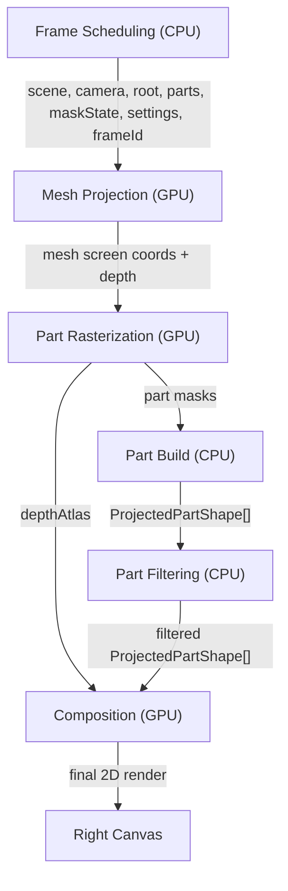

# 2DRender Pipeline

| Processing | Main files |
| --- | --- |
| `Frame Scheduling (CPU)` | [ProjectionOverlay.tsx](src/components/ProjectionOverlay.tsx), [overlayPipeline.ts](src/lib/2DRenderPipeline/overlayPipeline.ts) |
| `Mesh Projection (GPU)` | [2DRenderStages/meshProjection/](src/lib/2DRenderStages/meshProjection/) |
| `Part Rasterization (GPU)` | [2DRenderStages/partRasterization/](src/lib/2DRenderStages/partRasterization/) |
| `Part Build (CPU)` | [2DRenderStages/partShaping/](src/lib/2DRenderStages/partShaping/) |
| `Part Filtering (CPU)` | [2DRenderStages/partFiltering/](src/lib/2DRenderStages/partFiltering/) |
| `Composition (GPU)` | [2DRenderStages/composition/](src/lib/2DRenderStages/composition/) |
| `Shared Data And Helpers` | [2DRenderShared/](src/lib/2DRenderShared/) |
