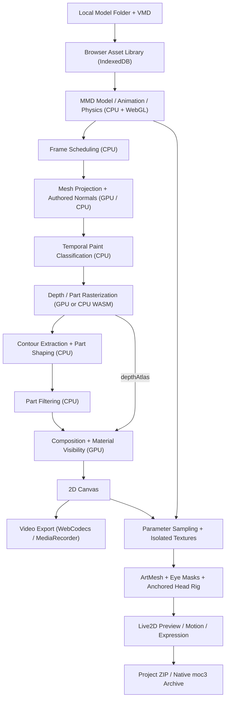

# 2DRender Pipeline — 3Dto2Dshape Fork

基于 [NikuKikai/3Dto2Dshape](https://github.com/NikuKikai/3Dto2Dshape) 的浏览器端 3D 转 2D 渲染项目。本分支继续扩展实时画面稳定性、MMD 本地素材工作流、Live2D 烘焙与原生模型导出。

**[在线使用](https://3-dto2-dshape.vercel.app/) · [本分支源码](https://github.com/ANGJustinl/3Dto2Dshape)**

## 本分支内容

| 内容 | 实现 |
| --- | --- |
| 本地模型与动作 | 导入 PMX / PMD 模型文件夹及贴图；单独添加 VMD；支持一个文件夹内切换多个模型。 |
| 浏览器素材库 | 保存文件本身及模型、动作选择，刷新后恢复；可切换已保存素材或移除浏览器副本。素材不会上传至服务器。 |
| 实时 3D 转 2D | 使用模型材质法线、明暗阈值滞回、稳定填色及深度遮挡，减轻头发、脸部和衣服色块反复出现、消失的问题。 |
| Live2D 烘焙 | 自动解析模型骨骼与表情，采样参数、拆分 ArtMesh、捕获贴图并生成参数关键形。 |
| 面部与颈部修复 | 统一脸部、眼睑与遮罩的表面变形；基于源骨骼的头部锚点和颈部过渡，改善转头漂移与分离。 |
| 模型文件 | 保存、重新打开本项目的模型 ZIP；导出包含 `.moc3`、`.model3.json` 和纹理图集的原生 Live2D 文件包。 |
| Live2D 动作与表情 | 预览导入的 Cubism `.motion3.json` / `.exp3.json`，支持官方动作段编码。 |
| 视频导出 | 输出 2D、3D 或左右对比；提供范围、帧步长、FPS、分辨率倍率及 MP4 / WebM 选择。 |

上述渲染修复使用共享材质、几何、骨骼与遮罩逻辑。模型仍需要提供合适的骨骼、表情和贴图，实际效果取决于素材结构。

## 本地运行

使用 Node.js 22.12+；本次发布构建使用 Node.js 24：

```sh
npm ci
npm run dev
```

打开终端显示的本地地址。生产构建与预览：

```sh
npm run build
npm run preview
```

2D 画面需要 WebGPU 与 HTTPS / localhost 环境。使用启用硬件加速、支持 WebGPU 的浏览器；不支持时，3D 视口仍可显示，2D 区域会给出提示。MP4 / WebM 编码能力由浏览器及设备决定。

仓库包含运行所需的轮廓 WASM 文件，普通使用不需要安装 Emscripten。修改 C++ 后才需要按照 [WASM 构建说明](native/wasm/README.md) 重新生成。

## 导入模型与动作

1. 解压模型包，点击 **导入模型文件夹**，选择包含模型和所有贴图的文件夹。保留素材原有目录结构。
2. 如果文件夹有多个 `.pmx` / `.pmd`，在 **模型路径** 中选择要使用的模型。
3. 点击 **添加 VMD 动作**，选择本地动作文件；也会自动收集模型文件夹内的 VMD。随后在动作下拉框中切换并播放。
4. 文件会自动保存。看到 **已保存在此浏览器** 后，刷新页面或下次打开相同网址即可恢复。

目录示例：

```text
MyModel/
  model.pmx
  textures/
    face.png
    hair.png
  motions/
    greeting.vmd
```

**选择模型及贴图** 可以一次选择多个文件，但浏览器可能不提供其子目录；贴图同名或目录复杂的模型请使用文件夹导入。支持常见 PNG、JPEG、BMP、TGA 等图片，以及使用这些图片内容的 SPH / SPA 材质文件。缺失或无法读取的贴图会显示错误。

浏览器通过文件选择器读取文件，不能凭输入的 `C:\...` 路径直接访问磁盘。这里显示和保存的是所选文件夹内的相对路径。

### 保存与空间

文件 Blob 保存在 IndexedDB，临时对象 URL 仅用于当前会话。当前模型和 VMD 选择与文件分开保存，切换时无需重写所有贴图。

- 保存仅属于当前浏览器、用户配置和网址。在线版与本地版、不同本地端口的素材库相互独立。
- **移除浏览器副本** 只删除网站保存的文件，不会删除原始本地素材。
- 如果空间不足或浏览器禁止保存，仍可在本次页面中使用，页面会明确提示刷新后需要重新选择；也可以稍后点击 **保存到浏览器** 重试。
- 清除网站数据、隐私窗口关闭或浏览器回收空间可能移除副本，请保留原始模型与导出文件。[浏览器存储说明](https://developer.mozilla.org/en-US/docs/Web/API/Storage_API/Storage_quotas_and_eviction_criteria)

素材库保存源模型、贴图和 VMD。Live2D 烘焙产物请通过导出 ZIP 单独保存；渲染参数不会自动保存。

## 2DRender Pipeline


```mermaid
flowchart TD
    Local["Local Model Folder + VMD"]
    Library["Browser Asset Library (IndexedDB)"]
    Scene["MMD Model / Animation / Physics (CPU + WebGL)"]
    Schedule["Frame Scheduling (CPU)"]
    Projection["Mesh Projection + Authored Normals (GPU / CPU)"]
    Paint["Temporal Paint Classification (CPU)"]
    Raster["Depth / Part Rasterization (GPU or CPU WASM)"]
    Shape["Contour Extraction + Part Shaping (CPU)"]
    Filter["Part Filtering (CPU)"]
    Compose["Composition + Material Visibility (GPU)"]
    Canvas["2D Canvas"]
    Video["Video Export (WebCodecs / MediaRecorder)"]
    Bake["Parameter Sampling + Isolated Textures"]
    Rig["ArtMesh + Eye Masks + Anchored Head Rig"]
    Preview["Live2D Preview / Motion / Expression"]
    Files["Project ZIP / Native moc3 Archive"]

    Local --> Library --> Scene --> Schedule --> Projection --> Paint --> Raster
    Raster --> Shape --> Filter --> Compose --> Canvas
    Raster -->|"depthAtlas"| Compose
    Canvas --> Video
    Scene --> Bake
    Canvas --> Bake
    Bake --> Rig --> Preview --> Files
```

| Processing | Main files |
| --- | --- |
| `Local Asset Library` | [WorkspaceApp.tsx](src/WorkspaceApp.tsx), [AssetLibraryPanel.tsx](src/components/AssetLibraryPanel.tsx), [localAssets/](src/lib/localAssets/) |
| `Scene / Frame Scheduling` | [App.tsx](src/App.tsx), [ProjectionOverlay.tsx](src/components/ProjectionOverlay.tsx), [overlayPipeline.ts](src/lib/2DRenderPipeline/overlayPipeline.ts) |
| `Mesh Projection / Authored Normals` | [meshProjection/](src/lib/2DRenderStages/meshProjection/) |
| `Temporal Paint / Visible Regions` | [temporalPaint.ts](src/lib/2DRenderPipeline/temporalPaint.ts), [visibleRegions.ts](src/lib/2DRenderPipeline/visibleRegions.ts) |
| `Part Rasterization` | [partRasterization/](src/lib/2DRenderStages/partRasterization/), [wasm/](src/lib/wasm/), [native/wasm/](native/wasm/) |
| `Contour / Part Shaping` | [partShaping/](src/lib/2DRenderStages/partShaping/) |
| `Part Filtering` | [partFiltering/](src/lib/2DRenderStages/partFiltering/) |
| `Composition` | [composition/](src/lib/2DRenderStages/composition/) |
| `Live2D Bake / ArtMesh` | [build.ts](src/lib/live2d/build.ts), [bake.ts](src/lib/live2d/bake.ts), [decomposition.ts](src/lib/live2d/decomposition.ts) |
| `Face / Eye / Neck` | [facialSurfaces.ts](src/lib/live2d/facialSurfaces.ts), [eyeOcclusion.ts](src/lib/live2d/eyeOcclusion.ts), [anchoredHeadSource.ts](src/lib/live2d/anchoredHeadSource.ts), [anchoredHeadRig.ts](src/lib/live2d/anchoredHeadRig.ts) |
| `Live2D Runtime / Files` | [runtime.ts](src/lib/live2d/runtime.ts), [motion.ts](src/lib/live2d/motion.ts), [expression.ts](src/lib/live2d/expression.ts), [serialize.ts](src/lib/live2d/serialize.ts), [moc3.ts](src/lib/live2d/moc3.ts) |
| `Video Export` | [videoExporter.ts](src/lib/export/videoExporter.ts), [h264Levels.ts](src/lib/export/h264Levels.ts) |
| `Shared Data / Defaults` | [2DRenderShared/](src/lib/2DRenderShared/), [defaultSettings.ts](src/lib/2DRenderShared/defaultSettings.ts) |

### Flat-Paint Style

纹理与材质颜色形成底色，骨骼变形后的材质法线与世界空间光照决定阴影、高光。各层独立栅格化、执行深度可见性裁剪并生成轮廓，再按材质透明度和绘画顺序合成。

本分支默认采用已验收的稳定填色配置：材质法线、明暗阈值滞回、材质可见性、严格深度遮挡与保留栅格轮廓。阴影强度、高光强度、简化、描线及光照等可在侧栏调整；高级选项保留其他频闪控制方案。

## Live2D Bake / Native Export

1. 加载模型，在 **Live2D Face Bake** 中选择贴图质量，点击 **Bake & build model**。
2. 等待采样与贴图阶段完成，检查解析到的参数、眨眼、嘴部及转头。
3. 在预览区使用 **Export .zip** 保存可重新导入本项目的模型；使用 **Export .moc3** 下载原生文件包。
4. 原生文件包解压后，将完整模型文件夹放入 VTube Studio 的 `Live2DModels` 目录，再在 VTS 中选择模型并配置跟踪参数。[VTS 官方导入说明](https://github.com/DenchiSoft/VTubeStudio/wiki/Getting-Started)

两种文件包用途不同：项目 ZIP 保存本项目的网格、关键形、遮罩与锚点数据；原生包包含 `.moc3`、`.model3.json` 和纹理图集，可供 Live2D 运行时加载。预览区的 **Import .zip** 读取本项目导出的 ZIP；目前不提供任意第三方 `.moc3` 的反向编辑。

可导入官方 `.motion3.json` 和 `.exp3.json` 驱动已烘焙模型中匹配的参数。MMD 的 `.vmd` 则用于烘焙前的 3D 动作，两者在各自的入口选择。

原生导出是 ArtMesh 与参数关键形的生成流程，仍属实验功能。先以约 ±15° 转头检查眼睑、嘴部、头发与颈部；极端姿态或模型缺少对应骨骼、表情时可能需要人工调整。已有模型包不会自动获得新的烘焙修复，需要重新烘焙。[实现与检查范围](docs/live2d-validation.md)

## Video Export

**Export Video** 支持 2D 画面、3D 视口和同步左右对比。设置起止源帧、帧步长、FPS 和输出倍率后导出。

WebCodecs 按帧编码并写入显式时间戳，视频时长为 `采样帧数 / 输出 FPS`；渲染计算耗时不会延长成片。VMD 源帧按 30fps 取样，输出 FPS 和帧步长会影响播放速度。编码器根据尺寸与帧率选择 H.264 level。没有 WebCodecs 时使用 MediaRecorder，耗时与时长可能受到实时录制性能影响。

导出期间暂停场景播放与素材切换，完成或取消后恢复原来的播放位置。输出分辨率由当前画布像素尺寸与倍率决定；当前导出包含画面，不包含音轨。

## Credits / License

管线与项目基础来自 [NikuKikai/3Dto2Dshape](https://github.com/NikuKikai/3Dto2Dshape)。本分支维护者：[ANGJustinl](https://github.com/ANGJustinl)。代码沿用 [MIT License](LICENSE)。

模型、动作、音乐和 Live2D SDK / Cubism Core 分别受各自许可约束，代码许可不授予这些素材的使用权。仓库不附带演示用角色、动作或 Cubism Core；请使用自己有权使用的本地素材。主应用的烘焙、预览和原生文件导出不依赖捆绑 Core；开发用原生 Core 对照页面的本地配置见 [public/preview/README.txt](public/preview/README.txt)。
